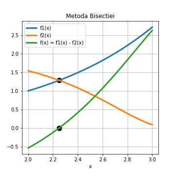
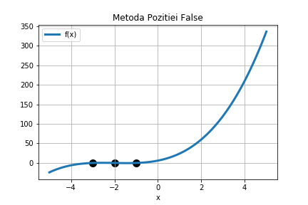
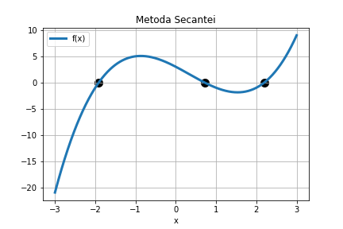

## Numerical analysis

Projects during the numerical analysis course.
Commentaries are in Romanian for the code


## Functions 

### Approximations of functions 
```functions.py```

This includes methods implementations in Python for several methods such as :

 - Newton - Raphson
 
 for f(x) = x ^ 2 - 7, x in R

 - Bisection Method
 
 for f(x) = e ^ (x - 2) - cos(e ^ (x - 2)) - 1, x in [2, 3]
 
 
 
 - False position method
 
 for f(x) = x ^ 3 + 6 * x ^ 2 + 11 * x  + 6, x in [-5, 5]
 
 
 
 - Secant method
 
 for f(x) = x ^ 3 - x ^ 2 - 4 * x  + 3, x in [-3, 3]
 
 
 
 ### Matrices
 ```matrices.py```
 
 The input can be easily changed to solve for different parameters
 
 - Gauss with total pivoting
 
 - Determining invertibility of matrix
 
 - Gauss method for determining invertibility of matrix 
 
 - LU factorization with partial pivoting
 
 - Cholesky factorization 
